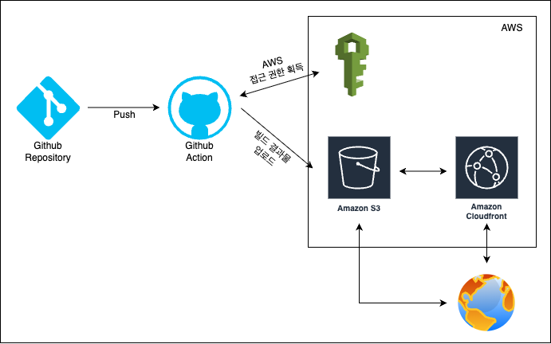
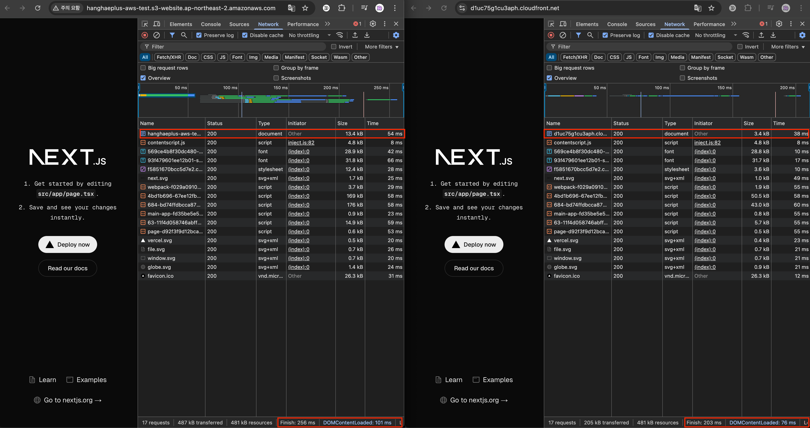

# 9주차 과제 - 인프라 관점의 성능 최적화

## 기본 과제

### 과제 목표

#### 기본과제

> S3와 CloudFront를 활용한 정적 웹사이트 배포 파이프라인을 구축하고, GitHub Actions를 통해 자동화된 CI/CD를 경험

#### 심화과제

> CDN 도입 전후의 성능 차이를 분석하여 CloudFront의 캐싱 효과와 정적 자산 최적화의 중요성을 이해

### 주요 링크

- S3 정적 웹사이트 엔드포인트: http://hanghaeplus-aws-test.s3-website.ap-northeast-2.amazonaws.com
- CloudFront 배포 도메인: https://d1uc75g1cu3aph.cloudfront.net

### 프론트엔드 배포 파이프라인



### 배포 프로세스

GitHub Actions를 이용해 `main` 브랜치에 push되거나 수동 실행(`workflow_dispatch`) 시 자동으로 배포가 진행됨.

#### 1. 코드 체크아웃

저장소의 코드를 runner 환경에 다운로드함.

```yaml
- name: Checkout repository
  uses: actions/checkout@v4
```

#### 2. 의존성 설치

package-lock.json을 기준으로 프로젝트 의존성을 설치함.

```yaml
- name: Install dependencies
  run: npm ci
```

#### 3. 프로젝트 빌드

Next.js 프로젝트를 빌드함.
next export 기반의 설정으로 out/ 디렉토리에 정적 파일을 생성함.

```yaml
- name: Build
  run: npm run build
```

#### 4. AWS 자격 증명 구성

GitHub Secrets에 등록된 값을 통해 AWS CLI 자격 증명을 구성함.

```yaml
- name: Configure AWS credentials
  uses: aws-actions/configure-aws-credentials@v1
  with:
    aws-access-key-id: ${{ secrets.AWS_ACCESS_KEY_ID }}
    aws-secret-access-key: ${{ secrets.AWS_SECRET_ACCESS_KEY }}
    aws-region: ${{ secrets.AWS_REGION }}
```

#### 5. S3 버킷 업로드

빌드된 정적 파일을 S3 버킷에 업로드함.

`--delete` 옵션으로 불필요한 파일을 정리함.

```yaml
- name: Upload to S3
  run: aws s3 cp out/ s3://hanghaeplus-aws-test --recursive --delete
```

#### 6. CloudFront 캐시 무효화

모든 경로(/\*)에 대해 CloudFront 캐시를 무효화함.

```yaml
- name: Invalidate CloudFront cache
  run: |
    aws cloudfront create-invalidation --distribution-id ${{ secrets.CLOUDFRONT_DISTRIBUTION_ID }} --paths "/*"
```

### 주요 개념

- GitHub Actions과 CI/CD 도구:  
  GitHub Actions는 코드 변경을 트리거로 자동화된 작업을 실행할 수 있는 CI/CD 도구로, 이번 과제에서는 코드 푸시 시 자동으로 빌드하고 배포하는 파이프라인 구성에 사용함.

- S3와 스토리지:  
  S3(Simple Storage Service)는 AWS에서 제공하는 객체 스토리지 서비스로, 이번 과제에서는 정적 파일을 업로드하고 웹사이트로 제공하기 위한 정적 웹 호스팅 기능을 활용함.

- CloudFront와 CDN:  
  CloudFront는 AWS의 콘텐츠 전송 네트워크(CDN) 서비스로, 전 세계 엣지 서버를 통해 S3의 정적 파일을 빠르게 전달하고 사용자 경험을 개선함.

- 캐시 무효화(Cache Invalidation):  
  CloudFront는 성능을 위해 파일을 캐시하지만, 새로 빌드된 파일을 사용자에게 즉시 보여주기 위해서는 기존 캐시를 무효화하는 작업이 필요함.

- Repository secret과 환경변수:  
  GitHub Actions에서 사용하는 민감한 정보(AWS 자격 증명, 버킷 이름 등)는 저장소의 Secret으로 안전하게 보관하며, 워크플로우 실행 시 환경변수로 주입하여 보안을 유지함.

### 학습 내용 정리

- 정적 사이트 배포를 위한 Next.js 빌드 구조

  `next export` 명령어를 통해 Next.js 프로젝트를 정적으로 변환하고, S3에 업로드 가능한 형태로 빌드 결과물을 구성함.

  `next build` 이후 `next export`를 실행하면 `out/` 디렉토리에 HTML, CSS, JS 파일이 생성되며, 이는 서버 없이도 정적 웹사이트로 배포 가능한 구조를 가짐.

  export 방식은 `getServerSideProps`, `API Routes`와 같이 서버 기능이 포함된 구성은 사용할 수 없고, `getStaticProps` 기반의 페이지만 지원함.

  이러한 제약을 이해하고 라우팅 및 데이터 처리 방식을 사전에 설계해야 함.

- AWS 리소스 간 연동 구조 구성  
  S3 버킷을 오리진으로 사용하는 CloudFront 배포를 생성하고, 두 리소스 간 연결을 통해 퍼블릭 정적 웹사이트를 글로벌 CDN으로 확장하는 구조를 직접 구성함.

  단순 파일 업로드를 넘어서, 웹 인프라 간 의존성과 흐름을 실습함.

- 워크플로우 단위의 CI/CD 구성  
  GitHub Actions를 활용해 배포 자동화를 구현함.

  `checkout`, `install`, `build`, `upload`, `invalidate` 각 단계가 명확히 분리된 워크플로우를 작성하고, 이를 통해 CI/CD 구성 시 단계별 역할 분리와 실패 지점을 명확히 관리하는 법을 학습함.

- CloudFront 캐시 전략 및 무효화 타이밍
  정적 자산 배포 시 캐시 정책에 따라 변경 사항이 반영되지 않을 수 있다는 점을 직접 경험하고, 이를 해결하기 위한 캐시 무효화 전략(`create-invalidation`)의 필요성과 적용 타이밍에 고민함.

- 배포 환경의 보안 구성과 유지 관리 전략
  민감 정보(AWS 자격 증명, 버킷 이름 등)를 GitHub Secrets로 안전하게 관리하고, 외부 노출 없이 워크플로우에서 활용하는 방식을 실습함.

## 심화 과제

### 성능 개선 보고서



> 좌측은 S3 배포, 우측은 CloudFront 배포

## 성능 비교 분석 (S3 vs CloudFront)

| 항목                 | S3 배포       | CloudFront 배포 | 비교 (감소율)                       |
| -------------------- | ------------- | --------------- | ----------------------------------- |
| **Finish**           | 256ms         | 203ms           | 약 **20.7%** 감소                   |
| **DOMContentLoaded** | 101ms         | 76ms            | 약 **24.8%** 감소                   |
| **Load**             | 222ms         | 183ms           | 약 **17.6%** 감소                   |
| **Transferred**      | 487KB         | 205KB           | 약 **57.9%** 감소                   |
| **Resources**        | 481KB         | 481KB           | 동일                                |
| **문서 파일 (HTML)** | 13.4KB (54ms) | 3.4KB (38ms)    | 크기 **74.6%**, 시간 **29.6%** 감소 |

CloudFront 배포는 전반적으로 전송 속도와 데이터 크기 측면에서 더 우수한 성능을 보임.

특히 HTML 문서의 크기와 전송 속도 개선이 뚜렷함.

### CloudFront와 S3의 속도 비교 및 성능 차이 분석

- **S3와 CloudFront의 성능 차이 실측**  
  동일한 정적 HTML 파일을 기준으로, S3는 `Finish: 256ms`, `DOMContentLoaded: 101ms`, `Transferred: 487KB`를 기록함.

  반면 CloudFront는 `Finish: 203ms`, `DOMContentLoaded: 76ms`, `Transferred: 205KB`로 더 빠르고 가벼운 응답을 보였음.

  특히 HTML 문서 파일만 비교해도, S3는 13.4KB/54ms, CloudFront는 3.4KB/38ms로 크기 기준 약 75%, 속도 기준 약 30% 가까이 개선됨.

- **속도 차이의 주요 원인: 캐시, 압축, 거리**  
  CloudFront는 사용자의 위치와 가까운 엣지 로케이션에서 파일을 제공하고, 콘텐츠에 Gzip 압축이 적용되어 전송 데이터의 양을 줄임.

  반면 S3 웹사이트 호스팅은 AWS 리전 내 단일 버킷에서 직접 콘텐츠를 내려주며, `Content-Encoding` 헤더 없이 압축되지 않은 상태로 전달됨.

  또한 S3는 각 요청마다 원본 서버에 직접 접근하므로 반복 요청에서도 성능 개선이 없음.

- **이로 인한 실질적 이점**  
  CloudFront를 통해 콘텐츠를 제공할 경우, 첫 요청 이후 캐시 적중이 발생하면서 반복 요청의 속도가 더욱 향상됨.

  데이터 전송량이 줄어듦에 따라 모바일 환경이나 저속 네트워크 환경에서도 페이지 렌더링 성능이 개선됨.

  사용자 경험 측면에서 초기 진입 속도 개선, 빠른 페이지 전환, 낮은 이탈률 등 직접적인 이점을 기대할 수 있음.

## 회고

### 느낀점

사실 웹 최적화라고 하면 프론트엔드 단에서 코드나 리소스를 줄이는 방식만을 떠올렸지, 이렇게 인프라 레벨에서 서버와 네트워크 구조를 바꾸는 것만으로도 큰 차이를 만들 수 있다는 점은 이번에 처음 체감했다.

특히 클라이언트가 받는 파일을 더 작고 빠르게 전송하는 것이 실제 사용자 경험에 직접적인 영향을 준다는 사실이 인상적이었고, 퍼포먼스 개선이 단순히 코드 레벨에 국한된 게 아니라는 점에서 시야가 넓어질 수 있는 경험이었다.

### 질문 사항

- Vercel, Netlify 같은 다른 배포 플랫폼에서는 이런 최적화를 어떤 방식으로 처리하고 있나요?
- CDN을 활용하지 않고도 비슷한 성능을 낼 수 있는 구조나 전략이 있을까요?
- 모든 프로젝트에 CDN이 최선일까요? 실시간성이 중요한 서비스나 캐싱이 오히려 문제를 일으키는 경우는 어떻게 대처해야 할까요?
